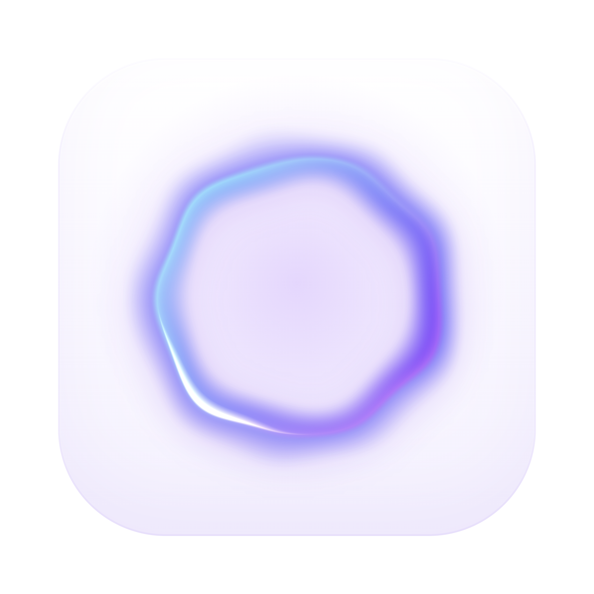

<p align="center">
  
</p>

<h1 align="center">MestreWrite</h1>

<p align="center">
  <a href="https://github.com/zezortdx/mestrewrite/stargazers">
    
  </a>
</p>

<p align="center">
  
  
  
  
</p>

<p align="center">
  <b>Escrita por voz em qualquer aplicativo — local, offline e privada.</b><br/>
  Aperte um atalho, fale, pare de falar: o texto aparece onde o cursor estiver.<br/>
  Sem nuvem, sem assinatura, sem espionagem.
</p>

## Status

Projeto em fase de protótipo (Work In Progress), com transcrição crua (fala → texto,
sem correção por IA ainda). macOS é a plataforma testada; o Windows é experimental
(código pronto e build via CI, mas ainda pouco testado). Escopo em
[docs/MVP.md](docs/MVP.md); direção em [docs/Roadmap.md](docs/Roadmap.md).

## Visão geral

- Escrita por voz em qualquer app (editor, navegador, chat, e-mail).
- Privacidade em primeiro lugar: transcrição 100% local via whisper.cpp.
- Para sozinho no silêncio: fale e solte; ele detecta a pausa e transcreve.
- Overlay elegante: orb iridescente animado e glow nas bordas (estética Apple Intelligence).
- Open source, licença MIT.

## Capturas

Tela de primeira execução (definir atalho, idioma e modelo) — tema claro, com o orb
como rosto do app:

| Atalho | Idioma | Modelo |
|:------:|:------:|:------:|
|  |  |  |

## Baixar e instalar

Baixe o instalador da sua plataforma na página de
[Releases](https://github.com/zezortdx/mestrewrite/releases). Tudo roda na sua
máquina — nada vai para a nuvem.

### macOS (Apple Silicon)

1. Baixe o `MestreWrite-<versão>-arm64.dmg`, abra-o e arraste o MestreWrite para a
   pasta Aplicativos.
2. Na primeira abertura (app não assinado): clique com o botão direito no app,
   depois Abrir, e Abrir de novo.
3. Instale os componentes de transcrição (uma vez), no Terminal — precisa do
   [Homebrew](https://brew.sh):
   ```bash
   brew install sox whisper-cpp
   mkdir -p ~/mestrewrite/models
   curl -L -o ~/mestrewrite/models/ggml-base.bin \
     https://huggingface.co/ggerganov/whisper.cpp/resolve/main/ggml-base.bin
   ```
4. Na primeira execução, faça o setup (atalho/idioma/modelo) e conceda Microfone e
   Acessibilidade quando o macOS pedir.

### Windows (experimental)

> Aviso: o suporte a Windows é novo e ainda pouco testado — feedback é bem-vindo.

1. Baixe e rode o `MestreWrite-Setup-<versão>.exe`. No aviso do SmartScreen:
   Mais informações, depois Executar assim mesmo (app não assinado).
2. Instale os componentes de transcrição (uma vez), no PowerShell:
   ```powershell
   # sox (escolha um): scoop install sox | choco install sox | winget install sox
   # whisper.cpp: baixe os binários do Windows em
   #   https://github.com/ggerganov/whisper.cpp/releases
   #   e deixe whisper-cli.exe no PATH (em builds antigos: renomeie main.exe para whisper-cli.exe)
   mkdir $HOME\mestrewrite\models
   curl -L -o $HOME\mestrewrite\models\ggml-base.bin `
     https://huggingface.co/ggerganov/whisper.cpp/resolve/main/ggml-base.bin
   ```
3. Abra o MestreWrite e faça o setup. O app encontra sox/whisper-cli pelo PATH.

### Usar (qualquer plataforma)

Aperte o atalho (padrão Cmd/Ctrl + Shift + Espaço), fale e pare de falar — ao detectar
a pausa, ele transcreve e cola o texto onde o cursor estiver. O app vive na barra de
menus / bandeja (ícone do orb); saia por ali.

> O próprio app avisa, com o comando exato, se faltar sox, whisper-cli ou o modelo.
> Empacotar tudo num instalador único está no [Roadmap](docs/Roadmap.md).

## Rodar do código-fonte (desenvolvimento)

Pré-requisitos: [Homebrew](https://brew.sh), [Node.js](https://nodejs.org/) versão 18
ou superior, e as dependências de transcrição.

```bash
brew install sox whisper-cpp
mkdir -p ~/mestrewrite/models
curl -L -o ~/mestrewrite/models/ggml-base.bin \
  https://huggingface.co/ggerganov/whisper.cpp/resolve/main/ggml-base.bin

npm install
npm start
```

Guia completo (permissões, troubleshooting, ajuste do silêncio) em
[docs/Setup.md](docs/Setup.md).

## Build (empacotar como app)

Com [electron-builder](https://www.electron.build/):

```bash
npm run dist:mac   # macOS:   dist/MestreWrite-<versao>-arm64.dmg (e .zip)
npm run dist:win   # Windows: dist/MestreWrite-Setup-<versao>.exe (NSIS)
npm run pack       # build rapido so do app (sem empacotar), para testar
npm run icone      # regenera icones (app + bandeja) a partir do orb
```

> Cada plataforma deve ser compilada no seu próprio sistema. O
> [GitHub Actions](.github/workflows/build.yml) faz isso automaticamente: a cada tag
> vX.Y.Z compila o .dmg (runner macOS) e o .exe (runner Windows) e anexa à Release.

> Builds não assinados (open source): primeira abertura via clique direito, Abrir
> (macOS) ou SmartScreen, Executar assim mesmo (Windows). O app encontra
> sox/whisper-cli pelo PATH automaticamente (só precisa estarem instalados).

## Documentação

A documentação completa é um vault Obsidian em [docs/](docs/) — comece por
[docs/00-Home.md](docs/00-Home.md). Decisões de arquitetura ficam em
[docs/Decisões/](docs/Decisões/) (ADRs).

## Como contribuir

1. Leia a [Visão](docs/Visão.md) e o [Roadmap](docs/Roadmap.md).
2. Abra uma issue descrevendo a melhoria ou bug.
3. Faça um fork, crie uma branch (feat/minha-feature) e abra um Pull Request.

## Licença

[MIT](LICENSE) (c) 2026 Pedro Júlio Cabral Neto
