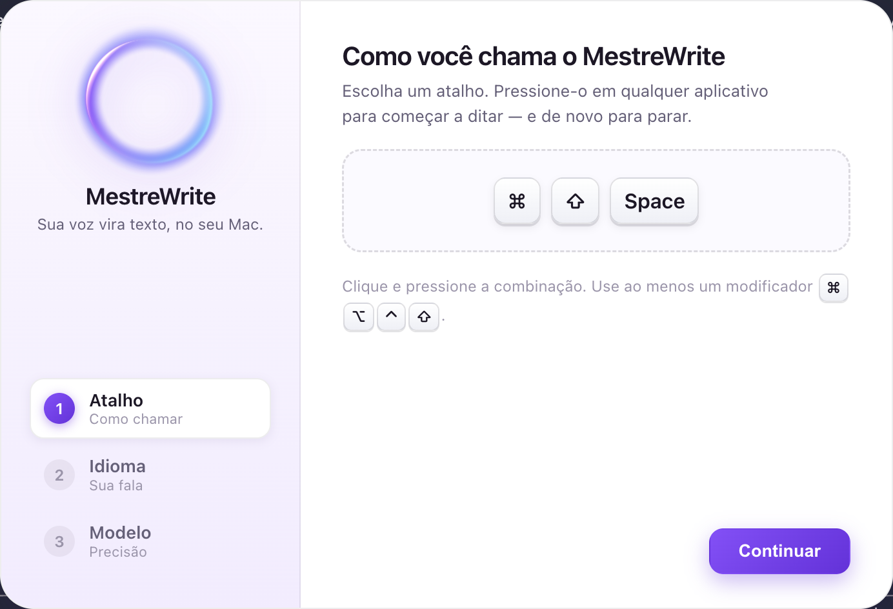
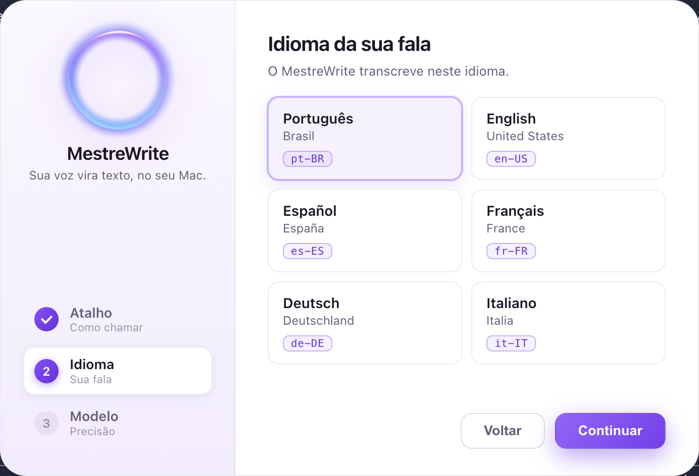
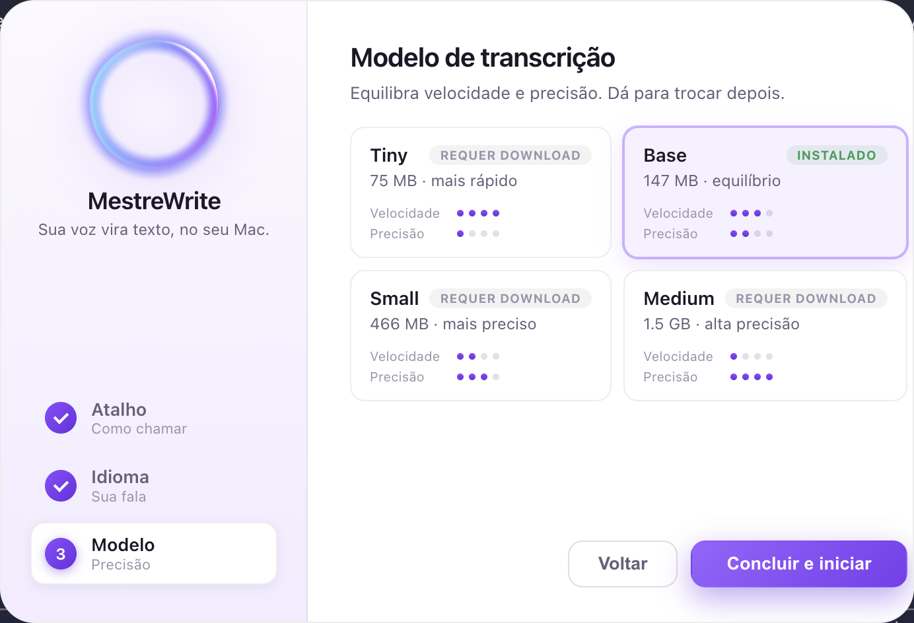

# Design

A presença visual do MestreWrite deve ser **bonita e discreta** (princípio da
[[Visão]]): aparecer quando preciso, comunicar o estado com clareza, e sumir sem
atrapalhar. A inspiração estética é a linguagem **Apple Intelligence**.

> A estética foi muito iterada. Esta nota descreve o **estado atual** (v2 — pílula
> + orb WebGL + glow nas bordas). O histórico da v1 (orb Canvas 2D + anel reto)
> está em [[ADR-004-overlay-visual]]; as mudanças da v2, em [[ADR-005-overlay-pilula-webgl]].

## A pílula de voz
O indicador principal é uma **cápsula branca "frosted"** (estilo *dynamic island*)
na parte inferior-central da tela, com dois elementos:

- **Orb iridescente** — uma esferinha luminosa com **redemoinho violeta/magenta/
  índigo** que gira e respira. É o rosto do MestreWrite. Renderizada em **WebGL**
  (shader), não mais Canvas 2D.
- **Waveform** — barras de áudio que ondulam, sugerindo a voz sendo captada.

A pílula sobe com leve *overshoot* elástico e tem um **halo violeta que respira**.

## O glow nas bordas
Um **glow colorido** (espectro Apple-IA: azul→violeta→magenta→rosa) que abraça as
**beiras de toda a tela** durante escuta e processamento, reforçando que o sistema
está captando a voz. As cores **fluem** (rotação lenta + oscilação de matiz +
respiração). **Não tem cantos/raio fixo**: a faixa desbota para dentro a partir de
cada beira e o arredondamento físico do display recorta o canto — encaixa em
qualquer tela (ver [[ADR-005-overlay-pilula-webgl]]).

## Ativação cinemática
Ao acionar o atalho (idle → ativo), há um **momento de ativação**: um *bloom* de
luz floresce nas bordas e toca um **chime suave** (sintetizado, estilo Apple
Intelligence). Feedback claro de "estou ouvindo".

## Estados visuais

| Estado | Significado | Aparência |
|--------|-------------|-----------|
| **idle** (ocioso) | Pronto, aguardando o atalho | Pílula e glow escondidos; animação pausada (poupa CPU) |
| **listening** (escutando) | Gravando o microfone | Pílula presente; orb girando calmo, waveform suave; glow tranquilo |
| **processing** (processando) | Transcrevendo via whisper | Orb e glow ~2× mais rápidos/intensos; waveform alta e ágil |

A transição entre estados é suave (aparição/sumiço da pílula e do glow). Após
processar, o texto é inserido (ver [[Arquitetura]]) e o overlay volta a **idle**.

## Setup de primeira execução
Na primeira vez, o app abre uma tela (tema **claro**) para definir **atalho**,
**idioma** e **modelo** — com a mesma identidade do overlay e **sem emojis**
(ver [[ADR-007-setup-primeira-execucao]]). Decisões de design:

- **Branco/frosted**, coerente com a pílula do overlay; o **orb é o único ponto de
  cor**. Layout em **duas regiões** (rail lateral + conteúdo), fugindo do cartão
  escuro centralizado genérico.
- **Orb real** (mesmo shader `orb-core.js`) no rail, que **energiza** durante a
  captura do atalho e **pulsa** ao concluir (com o chime).
- **Keycaps táteis**; modificadores em glifos mac (⌘ ⌥ ⌃ ⇧). Idiomas com nome
  nativo + tag de código; modelos com **medidores** de velocidade/precisão.

## Princípios de design

- **Discrição:** translúcido, sempre no topo, mas sem roubar o foco nem bloquear cliques.
- **Clareza de estado:** dá pra saber num relance se está escutando ou processando.
- **Movimento com propósito:** a animação (e o som) comunicam, não distraem.
- **Coerência:** uma única identidade visual (o orb) em todos os contextos.

## Implementação
O overlay já existe — primeira peça do [[MVP]]. Resumo (detalhes e justificativas
em [[ADR-004-overlay-visual]] e [[ADR-005-overlay-pilula-webgl]]):

- **Janela** (`src/main/main.js`): transparente, sem moldura, sempre no topo
  (`screen-saver`), cobrindo a tela inteira e **click-through**
  (`setIgnoreMouseEvents(true)`); `focusable:false`, `skipTaskbar`, dock escondido
  no macOS. Define `autoplay-policy: no-user-gesture-required` (pro chime tocar a
  partir de atalho global).
- **Orb** (`src/overlay/orb-core.js`): shader iridescente em **WebGL puro** (sem
  libs), exposto como módulo reutilizável; renderizado como mini-orb na pílula.
- **Pílula + waveform** (`src/overlay/pilula.js`): cápsula branca com orb + 16
  barras procedurais; **um único `requestAnimationFrame`** dirige orb e barras;
  dispara bloom + som na ativação. Pausa em idle.
- **Borda/glow** (`src/overlay/overlay.css`): `conic-gradient` mascarado por uma
  **união de 4 gradientes** (desbota das beiras), `blur`, drift + `hue-rotate` +
  respiração. Sem `border-radius`.
- **Estados** (`src/overlay/preload.js`): o main envia idle/listening/processing
  por IPC; o preload entrega via `contextBridge` (isolamento ligado, sem
  `nodeIntegration`).
- **Adaptação à tela**: posição, largura do glow e tamanhos são **proporcionais ao
  tamanho da tela**, recalculados em `resize`.

> Código em desenvolvimento; a estética foi muito iterada e segue ajustável.
> O orb grande original (`src/overlay/orb.js`) está no disco mas desativado.

Ver [[Stack-Técnico]], [[Arquitetura]] e [[ADR-001-electron]].

## Relacionado

- [[Arquitetura]] · [[Funcionalidades]] · [[Visão]] · [[MVP]] · [[ADR-004-overlay-visual]] · [[ADR-005-overlay-pilula-webgl]]
